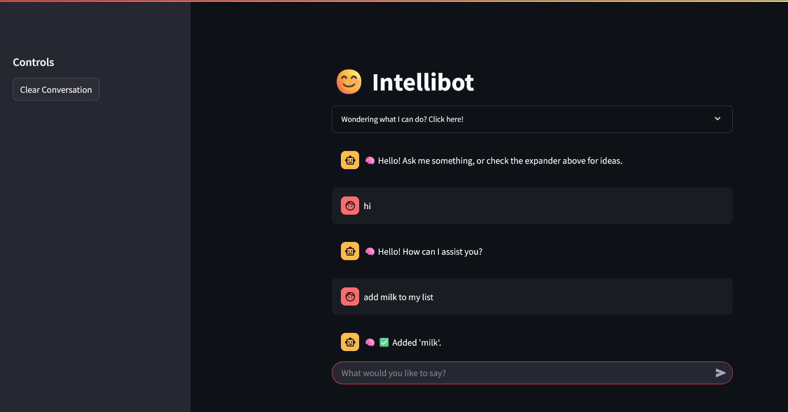

# Task 1: Intellibot - A Rule-Based Chatbot

This project is a sophisticated, rule-based chatbot named "Intellibot," built entirely with Python and the Streamlit framework. It is designed to be an interactive and engaging AI assistant that can handle a variety of tasks, remember context within a session, and even play games.

The core of this chatbot relies on regular expressions and a state management system to provide dynamic and context-aware responses without the need for a large language model.

---

## 📸 Application Demo




## 🚀 Key Features

Intellibot is packed with features that demonstrate conditional logic, state management, and user interaction:

- **Stateful Conversations:** Remembers your name, the items in your to-do list, and the current state of a game, all within a single session.
- **Interactive To-Do List:**
  - Add items (`add milk to my list`).
  - Remove items (`remove milk from my list`).
  - View the full list (`show my list`).
  - Clear the entire list (`clear my list`).
- **Fun & Games:**
  - **Guess the Number:** A multi-turn number guessing game (`start a game`).
  - **Jokes:** Can tell you a classic programmer joke (`tell me a joke`).
  - **Coin Flip:** A simple utility to flip a coin.
- **Practical Utilities:**
  - **Password Generator:** Creates a secure 12-character password on demand.
  - **Basic Calculator:** Solves simple arithmetic expressions like `what is 5 * 20?`.
  - **Decision Maker:** Can choose between two options for you (`choose between cats and dogs`).
- **Polished UI:** A clean and intuitive chat interface built with Streamlit, including a helpful expander that lists the bot's capabilities.

---

## 🛠️ Technology Stack

- **Language:** Python
- **Framework:** Streamlit (for the web interface and state management)
- **Core Logic:** Regular Expressions (`re`) for pattern matching.

---

## 🔧 How to Run This Project

To get Intellibot running on your local machine, please follow these steps:

1.  **Clone the Repository**
    ```bash
    git clone https://github.com/YourUsername/Codsoft-Internship.git
    ```

2.  **Navigate to the Project Directory**
    ```bash
    cd Codsoft/Tas1-Chatbot with rule based responses
    ```
    *(Adjust the folder name if you named it differently)*

3.  **Prepare a `dog.jpg` Image**
    For the "show me a dog" feature to work, you must place an image file named `dog.jpg` inside this project directory.

4.  **Install Required Libraries**
    This project only requires Streamlit. Install it using the `requirements.txt` file:
    ```bash
    pip install -r requirements.txt
    ```

5.  **Run the Application**
    Execute the following command in your terminal:
    ```bash
    streamlit run Chat.py
    ```

The application will automatically open in a new tab in your web browser. Enjoy chatting with Intellibot!