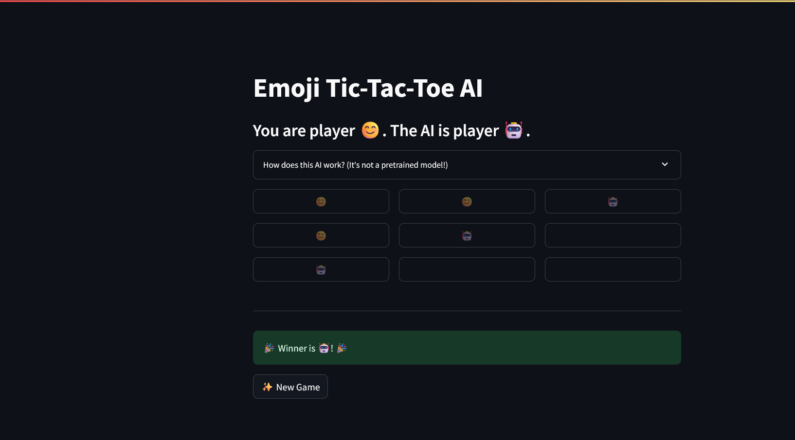

# Emoji Tic-Tac-Toe AI

This project is an interactive, web-based Tic-Tac-Toe game built entirely with Python and the Streamlit framework. It features an unbeatable AI opponent that uses the Minimax algorithm to calculate the perfect move every turn.

The core of this application is a classic game theory algorithm and state management within Streamlit, creating a challenging and engaging game without the need for a large, pre-trained model.

---

## 📸 Application Demo


*(**Note:** You should replace this with a real screenshot of your running application!)*

---

## 🚀 Key Features

This Tic-Tac-Toe game is packed with features that demonstrate game theory logic and a clean user interface:

- **Unbeatable AI:** Play against an AI that uses the Minimax algorithm, making it impossible to defeat.
- **Interactive Game Board:** A clean 3x3 grid with clickable buttons to place your moves.
- **Stateful Gameplay:** The application tracks the board state, the current player's turn, and the game's outcome (win, draw, or ongoing).
- **Clear UI and Game Status:**
  - Players are represented by fun emojis (😊 for Human, 🤖 for AI).
  - A status message clearly announces the winner or if the game is a draw.
  - A "New Game" button allows you to reset the board and play again instantly.
- **Educational AI Explanation:** Includes a built-in expander that explains how the Minimax algorithm works, offering insight into the AI's logic.

---

## 🛠️ Technology Stack

- **Language:** Python
- **Framework:** Streamlit (for the web interface and state management)
- **Core Logic:** Minimax Algorithm for the AI opponent.

---

## 🔧 How to Run This Project

To get the Tic-Tac-Toe AI running on your local machine, please follow these steps:

1.  **Get the Project Files**
    You can either clone the repository or save the `TicTacToe.py` and `requirements.txt` files to a new directory on your computer.

2.  **Navigate to the Project Directory**
    Open your terminal or command prompt and change to the directory where you saved the files.
    ```bash
    cd path/to/your/project
    ```

3.  **Install Required Libraries**
    This project only requires Streamlit. Install it using the provided `requirements.txt` file:
    ```bash
    pip install -r requirements.txt
    ```

4.  **Run the Application**
    Execute the following command in your terminal:
    ```bash
    streamlit run TicTacToe.py
    ```

The application will automatically open in a new tab in your web browser. Challenge the AI to a game!