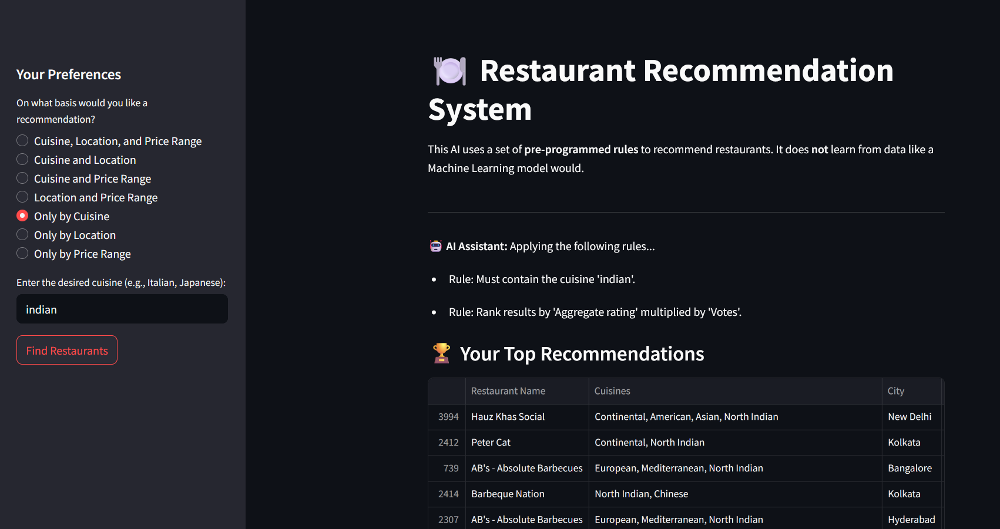

# Rule-Based Restaurant Recommender

This project is an interactive restaurant recommendation system built with Python, Pandas, and the Streamlit framework. It functions as a rule-based AI that helps users find the best restaurants by filtering a large dataset based on a specific set of preferences.

The core of this application relies on explicit, pre-programmed rules to filter and rank restaurants, demonstrating a classic approach to AI without using machine learning.

---

## 📸 Application Demo


---

## 🚀 Key Features

This restaurant recommender is built with a focus on user experience and a clear demonstration of rule-based logic:

- **Rule-Based Filtering:** The AI filters thousands of restaurants based on user-defined rules for cuisine, location (city), and price range.
- **Dynamic User Preferences:** A sidebar menu allows users to choose which combination of rules they want to apply (e.g., cuisine and location, or just price).
- **Intelligent Ranking System:** After filtering, the AI applies another rule to rank the results, sorting them by a `quality_score` (calculated as `Aggregate rating` * `Votes`) to show the most popular and well-regarded options first.
- **Efficient Data Handling:** Uses Streamlit's `@st.cache_data` decorator to load the dataset only once, ensuring the application is fast and responsive.
- **Clean & Interactive UI:** Built with Streamlit, the interface is clean, intuitive, and provides direct feedback on which rules are being applied for a given search.
- **User-Friendly Error Handling:** The application gracefully handles cases where the dataset file is not found or when no restaurants match the user's specific criteria.

---

## 🛠️ Technology Stack

- **Language:** Python
- **Web Framework:** Streamlit (for the interactive UI)
- **Data Manipulation:** Pandas (for loading, cleaning, filtering, and ranking the restaurant data)

---

## 🔧 How to Run This Project

To get this recommendation system running on your local machine, please follow these steps carefully:

1.  **Clone or Download the Project Files**
    Get the `Restaurent.py` and `requirements.txt` files and place them in a new project directory.

2.  **Download the Dataset**
    This project requires the Zomato restaurant dataset.
    - Download the file named **`Dataset.csv`**. A common source for this file is Kaggle.
    - **Crucially, you must place this `Dataset.csv` file in the same directory as your `Restaurent.py` script.**

3.  **Navigate to the Project Directory**
    Open your terminal or command prompt and move into the folder you created.
    ```bash
    cd path/to/your/project
    ```

4.  **Install Required Libraries**
    Install the necessary Python libraries using the `requirements.txt` file. It's recommended to do this in a virtual environment.
    ```bash
    pip install -r requirements.txt
    ```

5.  **Run the Application**
    Execute the following command in your terminal:
    ```bash
    streamlit run Restaurent.py
    ```

The application will automatically open in a new tab in your web browser. You can now set your preferences and find restaurant recommendations!